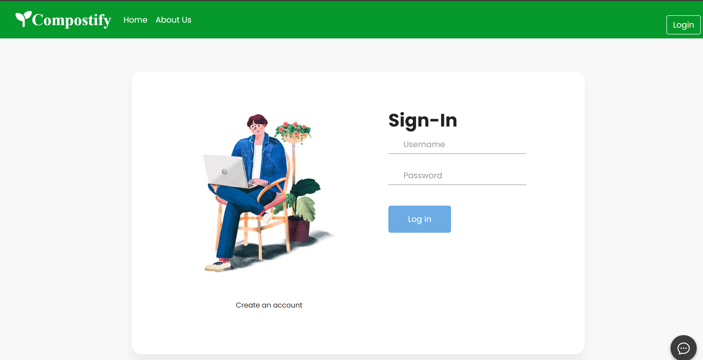
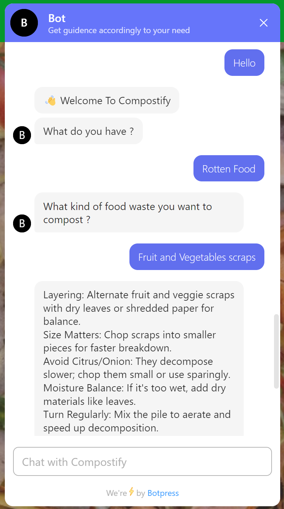
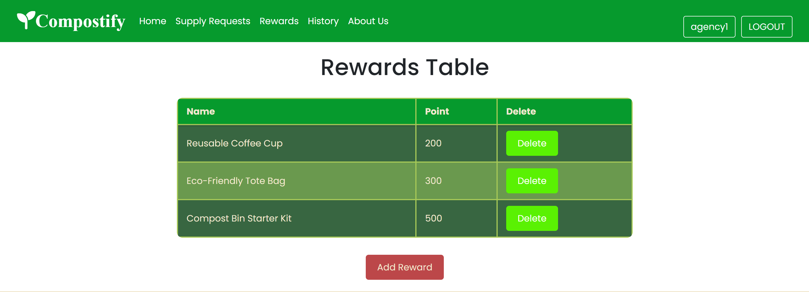
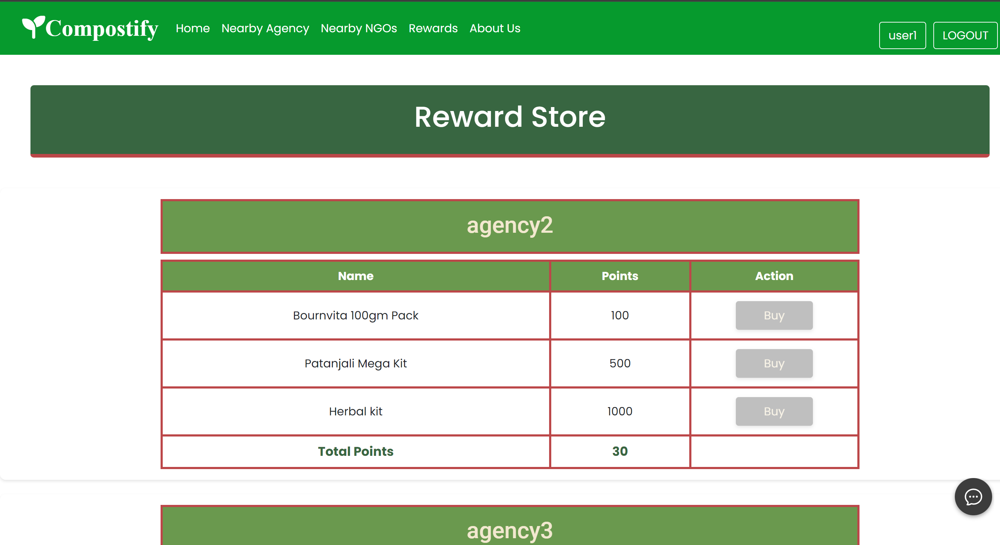

# 🌱 Compostify - Simplifying Sustainable Waste Management 🌱

- [🌱 Compostify - Simplifying Sustainable Waste Management 🌱](#-compostify---simplifying-sustainable-waste-management-)
  - [Introduction](#introduction)
  - [Use Cases](#use-cases)
  - [Showstopper Features](#showstopper-features)
  - [Technologies](#technologies)
  - [Demo](#demo)
    - [Features Showcase](#features-showcase)
    - [Specific Use Case Illustrations](#specific-use-case-illustrations)
  - [Team](#team)

## Introduction
Compostify is a revolutionary platform designed to streamline waste management practices, with a particular focus on composting and reducing food wastage. By providing a user-friendly interface and innovative features, Compostify aims to empower individuals, businesses, and organizations to make a positive impact on the environment.

## Use Cases
- *Effortless Waste Management*:
  - Compostify simplifies waste management with its intuitive login interface and GPS integration. Users can easily locate nearby compost agencies or NGOs for efficient disposal of leftover food.
  - The integrated chatbot offers personalized suggestions, ensuring users receive tailored assistance for their waste management needs.

- *Community Events and Restaurants with Surplus Food*:
  - In areas where community events and restaurants produce surplus food, Compostify serves as a connection hub between these entities and NGOs or compost agencies, minimizing food wastage.

- *Govt. Scheme "Madhyan Bhojan" Surplus Food*:
  - Compostify facilitates the redistribution of surplus food from government schemes like "Madhyan Bhojan" to other NGOs and agencies, ensuring no food goes to waste.

- *Vegetable Market*:
  - Vendors and handlers at vegetable markets can utilize Compostify to manage rotten vegetables by directing them to compost agencies for proper disposal.

## Showstopper Features
- *Innovative Points-based Reward System*:
  - Compostify incentivizes user participation through an automatic generation of reward points-based system, encouraging sustainable practices.

- *Smart Routing, Smart Impact*:
  - Intelligent routing algorithms ensure efficient transportation of donated food, minimizing resource wastage and maximizing impact.

- *Collaborative Network*:
  - Compostify fosters collaboration among users, NGOs, and composting agencies, creating a more sustainable food ecosystem.

- *Resource Optimization*:
  - Compostify minimizes resource wastage by efficiently matching surplus food with organizations in need, thereby reducing environmental footprint.

- *Interactive Chatbot Assistance*:
  - Compostify's integrated AI-powered 24/7 hotline chatbot provides real-time guidance on handling leftover or soon-to-expire food, offering suggestions for donation, composting, or other sustainable disposal methods.

## Technologies
- HTML
- CSS
- JavaScript
- MongoDB
- Node.js
- Express.js
- EJS
- Bootstrap

### Features Showcase

   ▪ *User Dashboard*
  
  
   ▪ *User Profile*
  
   ▪ *User Login*
  

  ▪ *Nearby Compost Agencies/NGOs*
  

   ▪ *Chatbot Assistance*
  

  ▪ *Rewards monitoring for Agency*
  

  ▪ *Reward store for Users to redeem Rewards*
  

## Team 
1. Dharmesh Kota
2. Krushi Sutariya
3. Aditya Patel
4. Rishit Unadkat
5. Jay Sabalpara
6. Bhavya Boda

🌱💚Together, let's compostify our world for a greener future!💚🌱

Thank you for your interest! 🌟✨